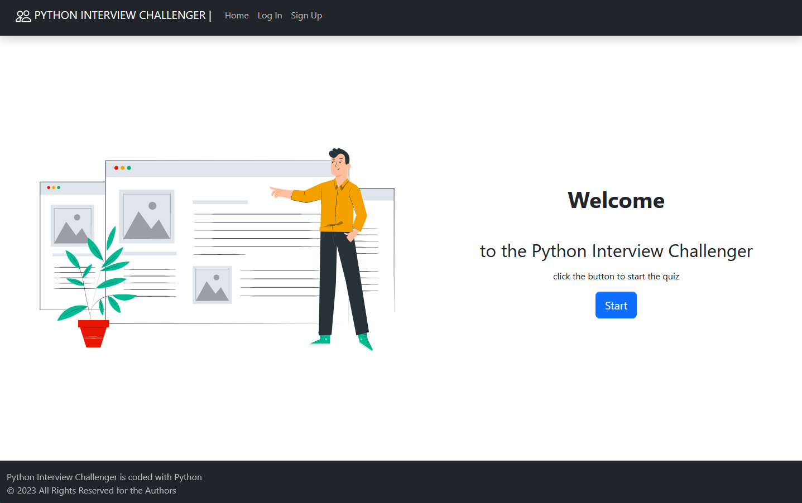
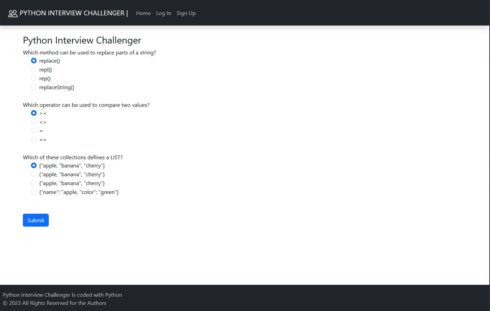
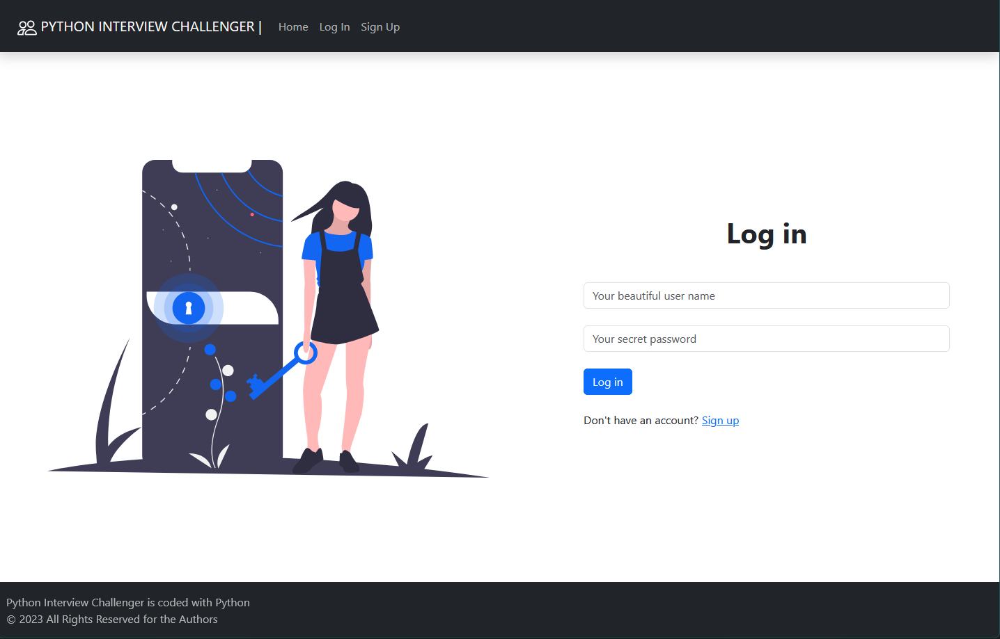
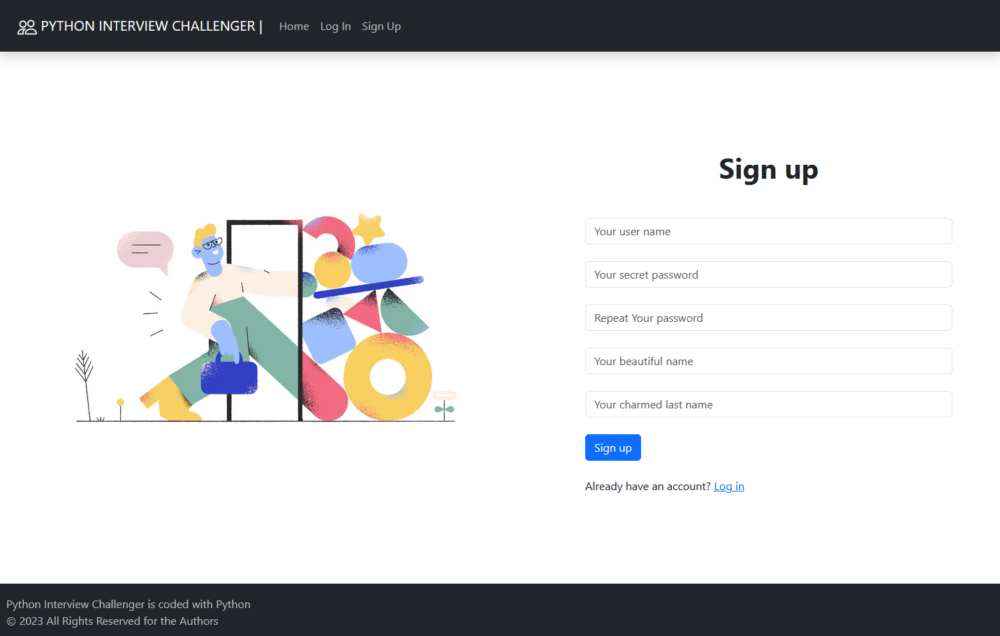
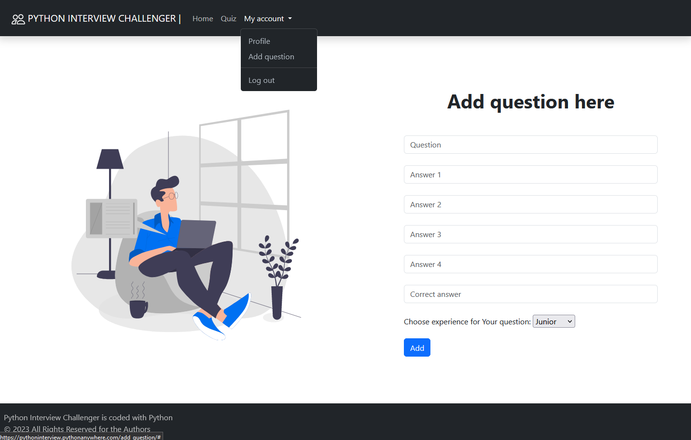

# Python Interview Challenger
> Web application to test a Python Developer candidate's knowledge
with the ability for a logged-in users to add their propositions for quiz questions.


## Table of Contents
* [General Info](#general-information)
* [Technologies Used](#technologies-used)
* [Features](#features)
* [Demo](#demo)
* [Screenshots](#screenshots)
* [Setup](#setup)
* [Usage](#usage)
* [Room for Improvement](#room-for-improvement)
* [Cooperators](#cooperators)


## General Information
Application coded using the Django framework to test Python language skills during a recruitment interview.

The project was developed by a team of three individuals in less than 10 days, following the MVP 
(_Minimum Viable Product_) approach. This involved brainstorming business ideas, designing architecture, logical,
implementing front-end elements and much more. 

Following a clear division of tasks, the team worked on bringing the developed concepts to life, 
resulting in the creation of this application. 

The MVP strategy allowed the team to focus on developing only the most essential features necessary
to deliver value to early users, with the goal of quickly testing the market and gathering feedback 
with minimal investment of time and resources.

Tanks to this project, I learned how to:
- code applications using **Django** framework,
- use queries in **Django ORM**,
- design app **front-end** using _HyperText Markup Language_ and _Cascading Style Sheets_,
- work with the **Bootstrap** framework,

and above all, I practiced application development in a team.


## Technologies Used
- [Python](https://www.python.org/) - version 3.11.3
- [PyTest](https://pypi.org/project/pytest/) framework - version 7.3.1
- [Django](https://www.djangoproject.com/) framework - version 4.2.1
- [SQLite](https://www.sqlite.org/) - version 3.42.0
- [HTML](https://en.wikipedia.org/wiki/HTML) - version 5
- [CSS](https://en.wikipedia.org/wiki/CSS) - version 3
- [Bootstrap](https://getbootstrap.com/) - version 5.3.0


## Features
- User authentication - users can _**register**_, _**login**_, and _**logout**_.
- Users can _**add**_ their propositions for quiz questions.
- A non-logged-in user can only answer three quiz questions.
- Logged in users can answer all questions of the quiz.
- Admin can approve or delete user propositions for quiz questions in the admin panel.


## Demo
If you want to check our app go to [pythoninterview.pythonanywhere.com](https://pythoninterview.pythonanywhere.com/)


## Screenshots

### Main page


### Example quiz, when You click `Start` button


### Log in page


### Sign up page


### Form to add a question to the database



## Setup
I assume You know how to cloning this repository. If not, I refer You to 
[this publication](https://docs.github.com/en/repositories/creating-and-managing-repositories/cloning-a-repository).

> If You don't have any Python version, download and install [from here](https://www.python.org/).

You can verify Python version by typing in terminal:
```bash
$ python --version
```

Now You need to create and activate _virtual environment_ like this:
```bash
$ python -m venv .venv
$ cd .venv\Scripts
$ activate
$ cd ..
$ cd ..
```

and install dependencies in the previously created _virtual environment_:
``` bash
$ pip install -r requirements.txt
```

You can also install _pytest_ package if You want to test app:
``` bash
$ pip install -U pytest
```

After installation, run the program as shown below.


## Usage
To set up the database type in terminal:
```bash
$ python manage.py migrate
```
To create a superuser:
```bash
$ python manage.py createsuperuser
```
To run the server with app:
```bash
$ python manage.py runserver
```


## Room for Improvement
To improving:
- Improving user panel
- Displaying questions (pagination)
- Compute users scores

To do:
- Add the ability to edit/delete added questions proposal by authenticated users
- More tests


## Cooperators
- This program was created with the cooperation of these nice people: 
  - [Edyta Drążkowicz](https://github.com/EDr918)
  - [Paweł Miduch](https://github.com/pamidev)
  - [Szymon Rębisz](https://github.com/SzymonRebisz)
- Many thanks to our trainer and mentor [Beata Zalewa](https://www.zalnet.pl/)
